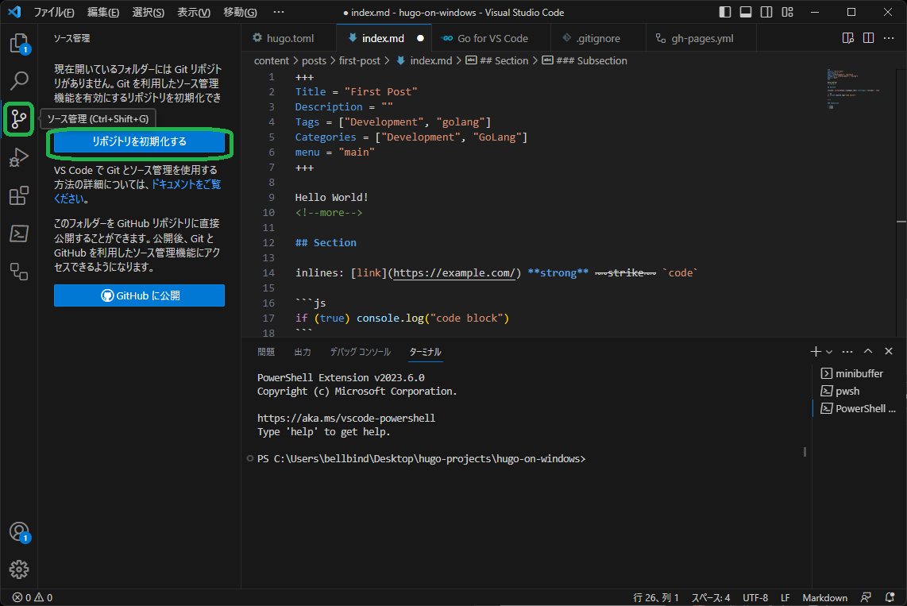

Windows11上でHugoプロジェクトをセットアップし、Github Pagesへの自動更新環境を作る方法。
<!--more-->

----
----

## 0. Windows11上での事前準備

1. Windows Updateを全更新の適用完了させる
2. Microsoft Storeのパッケージアップデート:  左下「ライブラリ」より行える
3. Microsoft Storeから、[Windows Terminal](https://apps.microsoft.com/store/detail/windows-terminal/9N0DX20HK701)のインストール: Microsoft Storeで「Terminal」で検索
4. Windows Terminalから、[PowerShellを最新版にアップデート](https://qiita.com/probabilityhill/items/f56c9b2882936c296c0e): 現時点の最新バージョンは7.3.4

```powershell
Invoke-Expression "& { $(Invoke-RestMethod https://aka.ms/install-powershell.ps1) } -UseMSI"
```

5. Windows Terminalから、[chocolateyインストール](https://chocolatey.org/install): ページ中央にあるコマンドをコピーしてTerminalに貼り付けEnter
    - chocoコマンドがインストール済みなら、全パッケージアップグレード: `choco upgrade all -y` (入れてあったパッケージがメンテされなくなった等で更新中断の赤警告がなくなるまで繰り返す)

----
----

## 1. 必要なchocoパッケージのインストール

「 **管理者として実行** 」によって、Windows Terminal(でPowerShell)を立ち上げる。

- 「ターミナル」アイコンの上で右クリックすることで、コンテキストメニューを開く


ターミナル上で、以下のコマンドで必要なパッケージをインストールする:

```powershell
choco install -y git golang hugo hugo-extended vscode
```

- git
- golang
- hugo
- hugo-extended
- vscode

記事編集環境としてvscode([Visual Studio Code](https://github.com/microsoft/vscode) )を使用する。

- vscodeを入れれば、Terminalからは、`code`コマンドによって、そのディレクトリを開いたvscodeを立ち上げることができるようになる

----
----

## 2. Visual Studio Codeのセットアップ

(最初は、一度、「Visual Studio Code」アイコンをクリックして立ち上げ、Japanese Language Packや既存エディタ風キーバインドなどの拡張機能をセットアップしておくとよい)

Hugoのためには、以下の拡張機能をインストールしておく: 

- Better TOML
- Hugo Language and Syntax Support
- PowerShell
- YAML


----
----

## 3. Hugoプロジェクトのセットアップ

- Githubユーザー(もしくはOrganization)名とリポジトリ名をもとに、Hugoプロジェクトの[Mod ID](../2023-06-12-hugo-mod/)(github上のプロジェクトのURLに基づくユニーク名)を決める
  - `github.com/bellbind-trial/hugo-on-windows`: 以降のHugoプロジェクト例のMod ID
- Hugoプロジェクトにする空ディレクトリを作成する
  - `hugo-on-windows`: Hugoプロジェクト例のディレクトリ名

vscodeを立ち上げ、、Hugoプロジェクトディレクトリを開く:  左上「≡」 -「ファイル」-「フォルダーを開く...」

----

### 3.1. vscode内でPowerShellを開く

PowerShellを開くと左の「エクスプローラー」が「COMMAND EXPLORER」に切り替わるので、エクスプローラーに戻しておく


----

### 3.2. PowerShellのターミナル内で`hugo mod init ...`実行

PoserShellのターミナルで、以下のコマンドを実行

```powershell
hugo mod init github.com/bellbind-trial/hugo-on-windows
```
(注: Mod IDは各自適切な名前にすること)


----

### 3.3. `hugo.toml`でテーマのModを加えhugo serverを実行

1. `content/`フォルダと、テーマのMod IDをセットした`hugo.toml`ファイルを作成する
    - 例: https://themes.gohugo.io/themes/poison/ : テーマの「Download」のgit URLからMod IDは `github.com/lukeorth/poison`を用いる
2. PowerShellのターミナルで、`hugo server`を実行する(hugo serverを実行しているPowerShellウインドウは閉じないこと)

```powershell
hugo server
```


手元のブラウザで`http://localhost:1313/`を開いてWebページが表示されることを確認する。

----
----

## 4. 記事の作成

例として、記事`posts/first-post/index.md`を作成する。
- この例で記事名を`posts/...`にしている理由は、これがpoisonテーマが要請するサイト構造だからである。テーマによって構造化に必要な記事名のパターンが存在しているので、説明やソースの`exampleSite`を見て調べてから記事を作成すること。

1. PowerShellの「+」でターミナルを追加する
2. 新たに開いたターミナルで、`hugo new posts/first-post/index.md`を実行する

```powershell
hugo new posts/first-post/index.md
```

3. 左の「エクスプローラー」から、`content/`フォルダを開き、`index.md`を編集する
4. ブラウザで記事が追加されていることを確認する


このあと、各テーマの説明ページにしたがって、`hugo.toml`を編集し、カスタマイズ(最初に書いた `[module]` 部分はファイルの一番うしろに置いてよい)し、公開してもよいように調整する。

----
----

## 5.Hugoプロジェクトをgitリポジトリ化する

重要: vscodeの「設定」で、**「Files: Eol」を`\n`に変更** すること。


----

### 5.1. `.gitignore` ファイルを作成

`.gitignore`ファイルの内容: 

```txt
/public/
/resources/_gen/
/assets/jsconfig.json
/.hugo_build.lock
hugo_stats.json
```

### 5.2. `.github/workflows/gh-pages.yml`ファイルを作成

- 参考: フォルダーのトップのファイルを選び「新しいファイル」でパス名に`.github/workflows/gh-pages.yml`を入れれば、親ディレクトリごと作られる

`.github/workflows/gh-pages.yml`ファイルの内容:

```yaml
name: GitHub Pages

on:
  push:
    branches:
      - main  # Set a branch name to trigger deployment
  pull_request:

jobs:
  deploy:
    runs-on: ubuntu-22.04
    permissions:
      contents: write
    concurrency:
      group: ${{ github.workflow }}-${{ github.ref }}
    steps:
      - uses: actions/checkout@v3
        with:
          submodules: true  # Fetch Hugo themes (true OR recursive)
          fetch-depth: 0    # Fetch all history for .GitInfo and .Lastmod

      - name: Setup Go
        uses: actions/setup-go@v4.0.0
        with:
          go-version: '^1.20'

      - name: Setup Hugo
        uses: peaceiris/actions-hugo@v2
        with:
          hugo-version: '0.113.0'
          extended: true

      - name: Build
        run: hugo --minify

      - name: Deploy
        uses: peaceiris/actions-gh-pages@v3
        # If you're changing the branch from main,
        # also change the `main` in `refs/heads/main`
        # below accordingly.
        if: ${{ github.ref == 'refs/heads/main' }}
        with:
          github_token: ${{ secrets.GITHUB_TOKEN }}
          publish_dir: ./public
```

----

### 5.3. gitリポジトリ作成(git initのGUI)

- フォルダーにリポジトリ(`.git/`)がなければ、左の「ソース管理」ボタンを選ぶと、「リポジトリ初期化」ボタンが出てくる
  - 「リポジトリ初期化」ボタンを押すと、`.git/`以下が作られ、以降gitリポジトリ管理の機能が使用可能になる



リポジトリ作成後、PowerShellのターミナルで、`git config user.name`と`git config user.email`を設定しておく必要もある。

- 参考: https://codelikes.com/git-config/
```powershell
git config user.name "githubで使っているユーザー名"
git config user.email "githubへ登録したメールアドレス"
```

(globalで設定してあれば不要)

----

### 5.4. ステージへのファイルの追加(git addのGUI)

注: 右下にある改行コード(赤囲い部分)は、クリックすれば変更でき、「CRLF」の場合は、追加前に「LF」に変更して「保存」しておく

- 各ファイルの右の「U」の状態は「更新あり」の意味
- 「変更」の「+」ボタンで、「U」つきファイルの一括追加ができる
  - 各ファイルの「+」ボタンで、個別の追加ができる


----

### 5.5. コミット

1. ステージに追加したファイルは、ファイルの右が「U」から「A」(「追加済み」の意味)になる  
2. 追加後、「コミット」ボタンを押すと、`COMMIT_EDITMSG`ファイルの編集が開く
3. ファイル内にコミットメッセージを埋め、**「保存」** する
4. 右上の「✓」ボタンを押すことでコミットが完了する


(より複雑な`git commit --amend`のようなものに相当する操作は、「ソース管理」の右の「・・・」の「コミット」メニュー内に存在する)

以降、編集作業は、ファイルの追加や更新をしたあと、変更ファイルのステージ追加(5.5.)とコミット(5.6.)を繰り返すことで行う。

----
----

## 6. github上のgitリポジトリと同期させる

gitリポジトリの内容をgithubへpushする大前提として、github上にアカウントがあり、sshの[公開鍵(`~/.ssh/id_rsa.pub`や`~/.ssh/id_ed25519.pub`など)を登録](https://docs.github.com/ja/authentication/connecting-to-github-with-ssh/adding-a-new-ssh-key-to-your-github-account)してある必要がある。

- 詳細は[付録A](#a-githubのssh認証設定方法)へ


----

### 6.1. github上で空リポジトリを作成

まず、github上に **空のリポジトリ** (READMEなし、Licenseと.gitignoreはすべてNone)を作成し、git URL(`git@github.com:....`)を控えておく


----

### 6.2. vscodeへgithubのリポジトリのgit URLを設定

1. 「ソース管理」の右の「・・・」から、「リモート」- 「リモートの追加...」を選ぶ
2. 上に出るinputフォームに、先程のgit URLを設定する


リモートの追加が行われると、コミットしてあれば、「変更の同期」ボタンが出るので、押すとpushされる。


Github  Actionsのための`.github/workflows/gh-pages.yml`を含めてあるため、「変更の同期」をすれば、githubクラウド上でHTMLファイルが入った`gh-pages`ブランチが作られる。

- github上の更新を取り込む方法は[付録B](#b-github上の更新をvscodeで反映させる方法)へ

----

### 6.3. github上のPages設定のブランチ変更

Github PagesでWebサイトを使用できようにするには、初回のpushを行ってHTMLファイルのある`gh-pages`ブランチが生成されたあとで、
github上でリポジトリトの「Settings」 - 「Pages」 - 「Branch」 で、「gh-pages」に変更する必要がある。


----
----

## A. githubのssh認証設定方法

以降のコマンド実行は、PowerShellターミナルで行う(vscode内のPowerShell環境でも可)。

- ssh関係のコマンドは標準でWindows11に入っている

### A.1. 公開鍵生成: `ssh-keygen`

ssh用公開鍵を作成する。いまから作るのであれば、アルゴリズムは[`rsa`](https://tex2e.github.io/rfc-translater/html/rfc8017.html)よりも
[`ed25519`](https://tex2e.github.io/rfc-translater/html/rfc8032.html)がよい。

```pwsh
ssh-keygen -t ed25519
```

以降、ファイル名やパスフレーズの入力を求められるが、文字は入れずに、生成がおわるまで全部**Enterキーのみ** を押しつづける。

以下のファイルが作られる:

- `~/.ssh/id_ed25519.pub`: 公開鍵テキストファイル
- `~/.ssh/id_ed25519`: プライベート鍵テキストファイル(このファイルからは`ssh-keygen -y`コマンドで公開鍵テキストも取り出せる)

### A.2. 公開鍵のテキストをクリップボードにコピー: `clip`

Windows11が備えるクリップボードへのコピーを行うコマンドは **`clip`** 。

```pwsh
cat ~/.ssh/id_ed25519.pub | clip
```

このコマンドを実行したら、公開鍵ファイルの内容を、Ctrl+Vで、ブラウザのテキストエリアへ貼り付けられるようになる。

### A.3. githubへ公開鍵を登録

サインインしたgithubのWebページの右のユーザーアイコン右の「▽」から「 **Settings** 」メニューを開き、左のリストの「 **SSH and GPG Keys** 」を開く。

この設定ページ内の「SSH keys」の右にある「 **New SSH key**」ボタンを押す。


入力項目が「Title」、「Key type」、「Key」とあるうちの **「Key」テキストエリア** に、Ctrl+Vで先ほどコピーした公開鍵テキストを貼り付け、
**「Add SSH key」ボタン** を押す(Titleは空欄、Key typeは"Authentication Key"のままでよい)。


すると`Authentication Keys`に公開鍵が追加される。
この結果、このマシンから、githubへpushすることができるようになる。

----
----

## B. github上の更新をvscodeで反映させる方法

「同期」をすれば、リモートの更新をローカルへ反映させることができる。

vscodeには、「同期」実行の２つのUIがある。

- 「ソース管理」のメニューから「同期」を選ぶ
- 左下の「🔄」を押す


----
----
