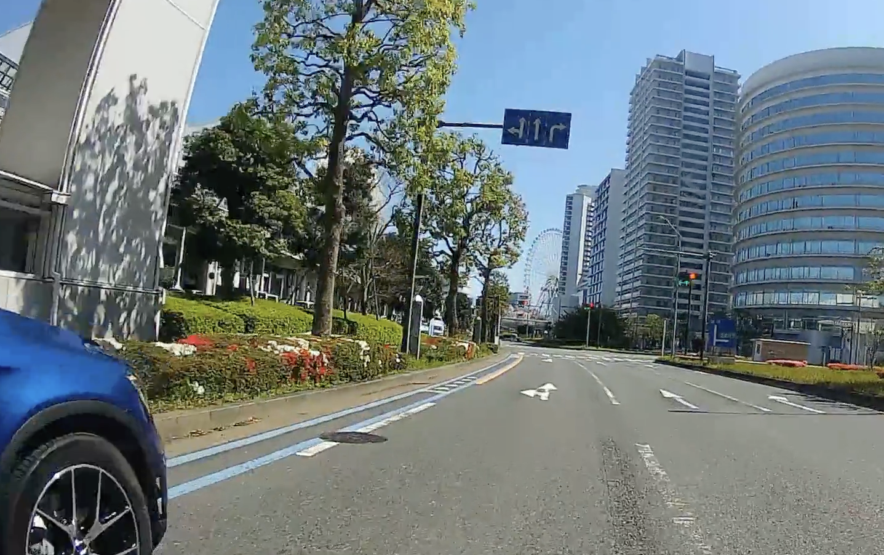
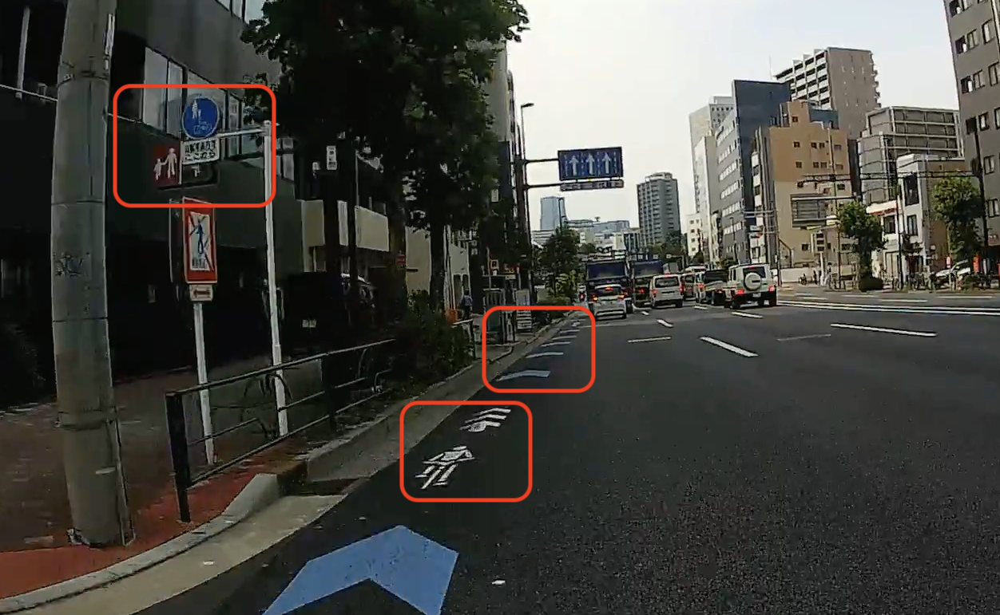
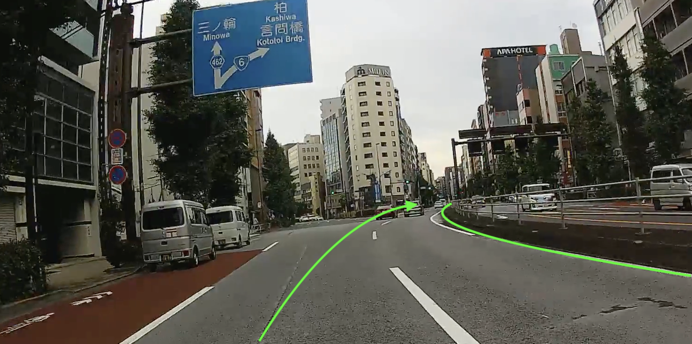

自転車を乗る場合に必要な知識として、道路標識を解説してみた。
<!--more-->

----

## 普通自転車専用通行帯

路面が青帯に白文字で「自転車専用」などと描かれた部分が、**普通自転車専用通行帯**です。
かならず、この写真例のような車線に「⬆🚲専用」青標識があります。

普通自転車通行帯は、自動車が通るものと同じラインで区切られた一つの**車線**です。路肩ではありません。
道路標識でも片側の車線数の左端の車線であることが明示されます。
この例では片側２車線のうち、左端が自転車専用という意味です。自動車用車線が2つの場合は、標識に点線区切りの線がもう一本入ります。

また、普通自転車通行帯がある場所は、すべて**駐車禁止**です。
この例のように、どこかに駐車禁止標識(紺地に赤斜線の丸標識)があるのが普通だけれど、標識がなくても路駐禁止です。
駐車禁止の標識があったり、駐停車禁止の標識(紺地に赤バツの丸標識)がなければ、停車禁止ではないです。

ただし、現状は、路駐禁止であることを認識していないドライバーが多すぎるので、都内ではほぼ路肩の駐車スペースように扱われてしまっています。

これは横浜みなとみらいの普通自転車専用通行帯ですが、黄色線で車線が区切られている珍しい例です。
信号待ちでは広がらず縦に並べ、という意味だとは思います。

左に車が止まってるけれど、駐車ではない停車なんでしょうね。

----

## 自転車ナビライン

車道の斜線の左にある青矢印は「自転車ナビライン」とよばれるものです。
白の自転車マークは「自転車ナビマーク」と呼ばれていますが、自転車ナビラインとまったく同じ意味です。
この例のように、ナビラインとナビマークを混ぜてペイントしている場所も多いです。

**進行方向と自転車の走路の目安**であり、車両への法律上の制約を示したものではありません。

自転車ナビラインは、**車線中の左の一部**にペイントされているものであって、(普通自転車専用通行帯のように)それ自体が独立した車線ではありません。
車線であることから、通行禁止である車道の左端からは、50cm以上は離れているはずです。

また、この写真の歩道にある標識は、この歩道が「自転車歩行者道」であることを示す標識です。
ちなみに、自転車歩行者道を自転車で走る場合は、歩道の中心から車道側のうちの左側を「直ちに停止できる」速度で走る必要があります。

----

## 自転車道

この写真の右側の表式が、**自転車道**を表す標識です。左側は「自転車歩行者道」です。

自転車道は双方向ですが、左側走行する必要があります。

自転車道はかならずその車線が、**歩道と車道双方から物理的に分離**されています。
この例では植え込みで分離されています。

この自転車道は、**普通自転車**に該当する自転車以下のサイズの軽車両だけが走行可能です。

MTBなどでハンドル幅が60cmを超える自転車や、人力車などの大きな軽車両は、この自転車道は走行できません。
この場合は、車道を走らなくてはいけません。

また、以下の例のような、青丸標識ではない自転車標識や道路を色で塗り分けているだけの構造は、自転車歩行者道での自転車走行部分を示す目安です。
自転車道ではなく、歩道の一部となります。

ちなみに、この「自転車道」の標識は、サイクリングロードである「自転車専用道路」でも使用されます。

自転車道が車道と歩道に並走して敷設されるのに対し、自転車専用道路は車道とは無関係に敷設された道路になります。

ちなみに、ほぼすべてのサイクリングロードは、自転車専用道路ではなく、自転車歩行者専用道路(これも自転車歩行者道と同じ標識を使用)になっています。
この写真は、自転車専用道路である、カムイコタンのサイクリングロードの深川側の入口です。

----

## 自転車歩行者専用道路

河川敷などのサイクリングロードと呼ばれる道路は、ほぼ、この写真のようなに「自転車歩行者専用道路」です。

標識は、歩道での「自転車歩行者道」と同じものを使用していて、車道と隣接してないことで区別します。

左側走行で、「安全に走行」する必要があります。

最低でも、歩行者との間の側方距離はスピードに応じて十分に取りながら走りましょう。

----

## 歩行者専用道路

この写真の遊歩道(古隅田川暗渠)は、普通自転車走行可の「歩行者専用道路」です。

徐行走行が必須です。走行するのであれば、侵入ガードのある狭い道をふらつかずに走れる能力は必要でしょう。

また、つぎの写真は、小学校に隣接する、普通自転車通行可の「時間帯歩行者専用道路」の例です。

この写真の標識では、7時から17時までのあいだ、**車道全体**が歩行者専用道路になります。

しかし、この標識は認知されておらず、この時間帯でも通り抜けをする自動車が非常に多いのが現状です。
ここについては、あまりに自然に多くの自動車が通り抜けているものだから、小岩警察署へ電話して、歩行者専用が有効であることを確認しました。

----

## 路側帯

この写真での緑に塗られた部分が**路側帯**です。
緑や赤で塗られていなくても、歩道のない車道にある側線の外側は路側帯になります。

自転車は路側帯では徐行走行し、**逆方向に走行してはいけません**。路側帯内で逆方向に行く場合は、降りて歩く必要があります。

----

## 一時停止

一時停止の標識があれば、停止線(「止まれ」やまれに「とまれ」)の**手前**で、一旦停止してから、進行します。

二輪車の場合、お巡りさんが認識しやすいようにするには、止まったときに足をつけるのが良いでしょう。

----

## 歩行者自転車専用信号

進行方向にある横断歩道の信号が「自転車歩行者専用」という表示のある信号の場合、自転車は、車道の信号ではなく、**歩道の信号に従う**必要があります。

進行方向に横断歩道がある場合だけでなく、対向車線側にのみ横断歩道ある場合で歩行者自動車専用信号のケースがあります。
この状況で右折する場合は、二段階右折ではなく、先に右へ横断してから、さらに横断することになります。

この写真は、皇居の半蔵門交差点の新宿通りが内堀通りにぶつかる丁字路です。
内堀通りにはこの北側にのみ横断歩道があり、南側には存在しません。
内堀通りを南下して新宿通りに右折する場合は、先にこの信号で内堀通りを横断してから、新宿通りを横断する必要があります。

----

## 自転車走行禁止車道

この写真のように、車道自転車走行禁止標識(自転車に赤斜線の丸標識)がある場合は、歩道内を走行することになります。

また、幹線道路のアンダーパスやオーバーパスでも自転車は走れないことが多いです。

この場合は、側道に入り、自転車が通れる迂回路を探すことになります。

この標識は、自転車に限らない軽車両のトンネル内走行禁止です。

自転車マークではなくオートバイマークの「二輪車走行禁止」の標識の場合(原付表示や排気量表示であっても)でも、自転車も走行はできません。

----

## 直進方向＝センターライン

道路の直進方向は、対向車線との間の**センターライン**に沿った方向です。
左側線の方向ではありません。
センターラインから外れた左方向の進路は左折先であり、そこへ入ることは進路変更になります。

自転車の場合、ギリギリ追い越しでかぶせ左折してくる自動車やオートバイが非常に多いのが現状です。
センターライン側が直進であること自体を知らないドライバーも多いのでしょう。左方優先などと同様、事故の当事者にならなければ認識されないのでしょう。

このため、分岐の10秒前くらい前もってセンター方向へよっておいて、左側を通させるほうのが安全です。
右によるときは必ず手信号は出し、後ろを振り向いて後方確認して後続車を牽制しましょう。

この写真は蔵前の国際通りに分岐する江戸通りですが、左を走ると国際通りに入ろうとする車が被せ左折してきます。
この写真の道路中央の、道路の縦の割れ目の先には、江戸通りに沿った線がありますが、それに沿って走行しても被せ左折されました。
江戸通りを直進する意志を明示するために、更に右の線までよる方が安全でしょう。

----

